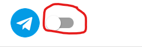
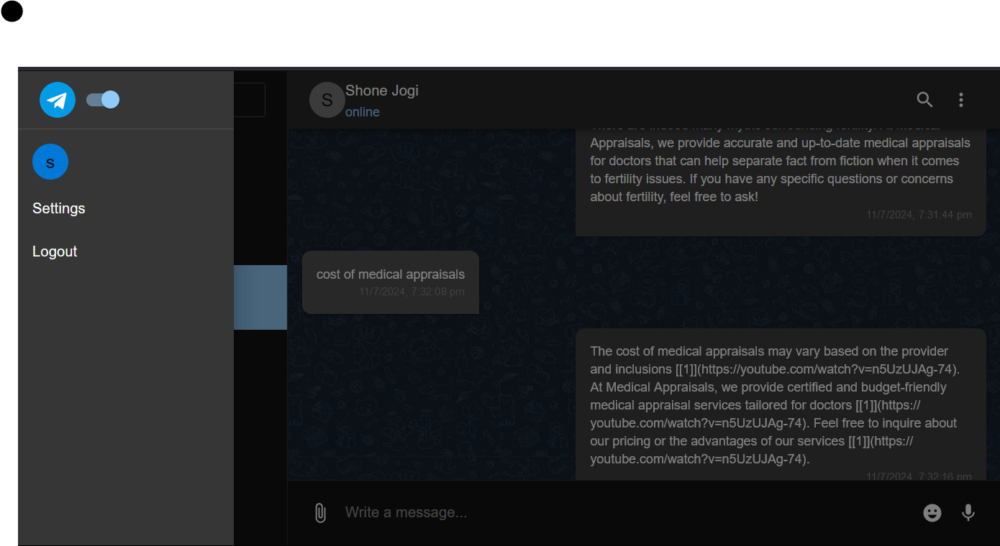
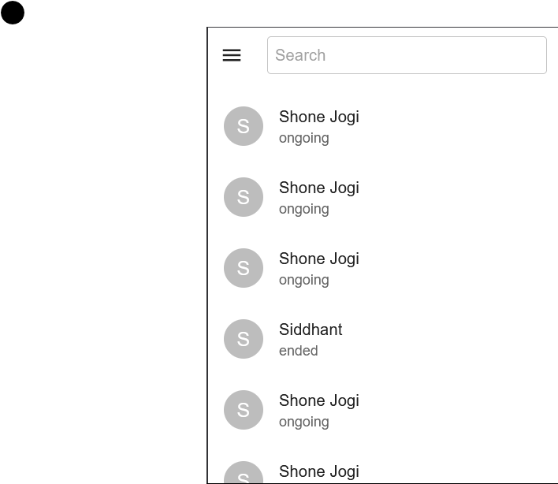
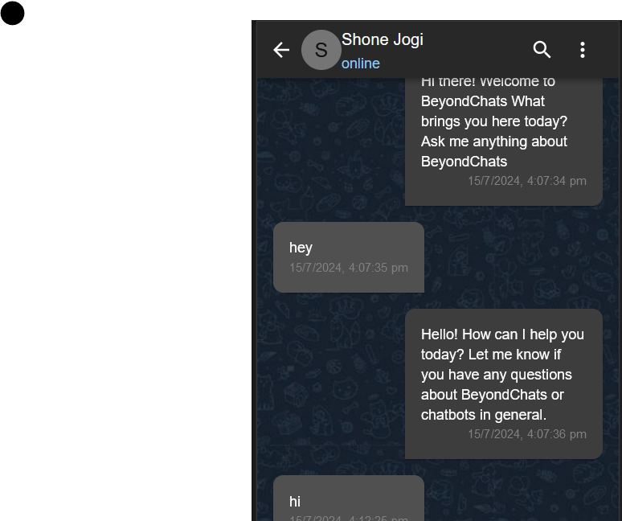
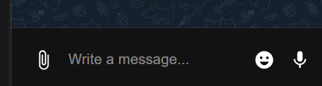
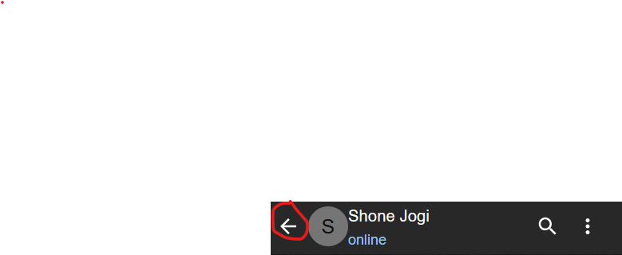
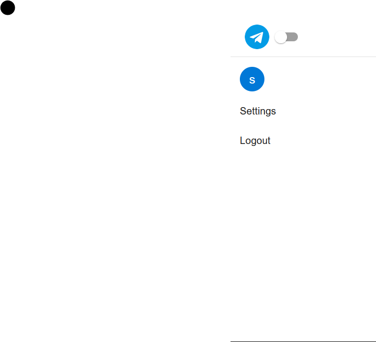

# Getting Started with Create React Telegram-Clone https://telegram-clone-rudrapriya.vercel.app/

 # Create React App(https://github.com/facebook/create-react-app).

# Chat Application

This is a responsive chat application built with React and Material-UI. The application displays a list of chats and allows users to view messages within a selected chat. The UI adapts to mobile and desktop views, providing a seamless user experience.

## Features

- **Responsive Design**: Optimized for both mobile and desktop views.
- **Dark Mode Toggle**: Switch between light and dark themes.
- **Chat List**: Display a list of chats with search functionality.
- **Chat Messages View**: View messages within a selected chat with support for media queries.
- **Sidebar Navigation**: Includes settings and logout options.
- **Profile lists in chatlist items and Profile in message room

## Screenshots

### Desktop View when clickend on a chat


### Dark Mode Light Mode toggle button


### Desktop View for Dark mode


### Mobile View for chat lists


### mobile view for messages


### chat bar


### Back button for back to chat lists


### sidebar when click on Humburg


## Installation

1. **Clone the repository**:
    ```sh
    git clone https://github.com/Rudra-Maity/telegram-clone.git
    cd telegram-clone-main 
    ```

2. **Install dependencies**:
    ```sh
    npm install
    ```

3. **Start the development server**:
    ```sh
    npm start
    ```

## Usage

Open your browser and navigate to `http://localhost:3000`. You will see the chat application with a list of chats on the left side and the chat messages on the right side. On mobile devices, you will see either the chat list or the chat messages, with a back button to navigate between them.

## Deployment server

Open your browser and navigate to `https://telegram-clone-rudrapriya.vercel.app/ `. You will see the chat application with a list of chats on the left side and the chat messages on the right side. On mobile devices, you will see either the chat list or the chat messages, with a back button to navigate between them.

# Automatic Deployment with GitHub:
If your project is hosted on GitHub, you can link your repository to Vercel for automatic deployments. Every time you push changes to your repository, Vercel will automatically build and deploy the latest version of your application.

To link your GitHub repository:

   1. Go to your Vercel dashboard.
   2. Click on the "New Project" button.
   3. Select your GitHub repository and follow the prompts to configure the project settings.
    Once linked, Vercel will deploy your application whenever you push changes to the repository.


## Testing

The application includes a set of tests written with Jest and React Testing Library. To run the tests, use the following command:

```sh
npm test

This section has moved here: [https://facebook.github.io/create-react-app/docs/troubleshooting#npm-run-build-fails-to-minify](https://facebook.github.io/create-react-app/docs/troubleshooting#npm-run-build-fails-to-minify)
